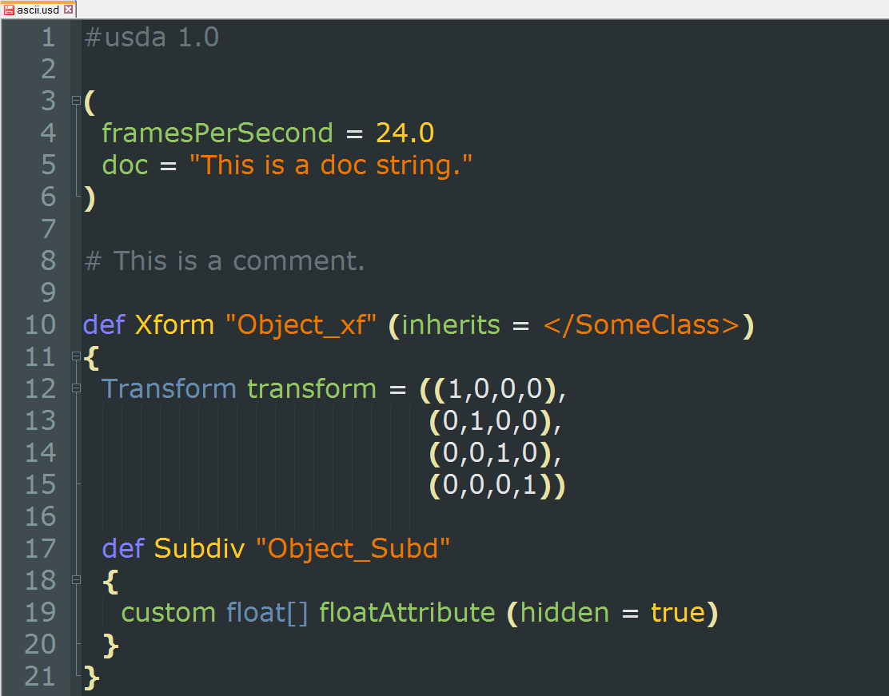

# PIXAR USD Syntax Highlighter #
**Version 0.2** Released 2016-01-21  
by Andrew Hazelden  

## Overview ##

This is a proof of concept Notepad++ syntax highlighting module for the code from **[Pixar's USD format](http://graphics.pixar.com/usd/)**. Since the **Universal Scene Description**  format hasn't been formalized yet, the syntax highlighter will be updated as more information is released.

## Version History ##

### Version 0.2 - 2016-01-21 ###

- Added support for highlighting files with the .usda file extension

### Version 0.1 - 2013-12-13 ###

- Created the initial USD syntax highlighter module for Notepad++

----------

Cheers,  
Andrew Hazelden

Email: [andrew@andrewhazelden.com](mailto:andrew@andrewhazelden.com)   
Blog: [http://www.andrewhazelden.com](http://www.andrewhazelden.com)  
Twitter: [@andrewhazelden](https://twitter.com/andrewhazelden)  
Google+: [https://plus.google.com/+AndrewHazelden](https://plus.google.com/+AndrewHazelden)
